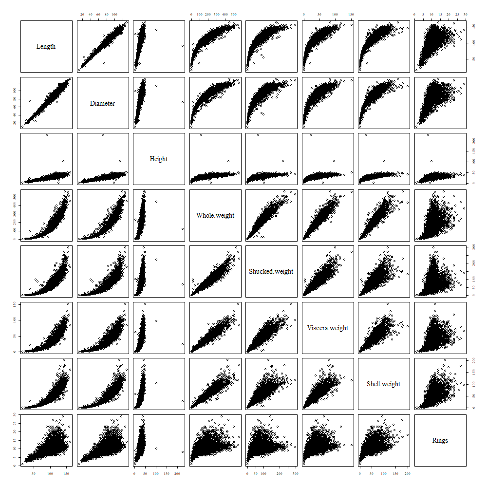

```{css echo=FALSE}

h1, h2, h3 {
    font-weight: bold;
}

h1.title {
    font-size: 2em;
}

h2 {
    font-size: 1.5em;
}

h3 {
    font-size: 1.2em;
}

```

## 1. Exploratory Analysis

```{r, message=FALSE}
library(MVN)
library(heplots)
library(e1071)
library(MASS)
library(dplyr)
library(knitr)
library(kableExtra)

select <- dplyr::select

# plot styling
par(
    family = "serif",
    ps = 12,
    mar = c(1, 1, 4, 1),
    xaxt = "n",
    yaxt = "n",
    font.main = 1
)

params <- par(no.readonly = TRUE)

# table styling
nice_table <- function(data) {
  kable(data) %>% kable_classic(
    full_width = FALSE, position="left", font_size=14)
}

# data input
abalone <- read.csv("abalone.csv")

# list of just the numerical variables
cols <- colnames(abalone)[-1]
```

### 1.1 Summary statistics

Statistical summary for each numerical variable.

```{r}
nice_table(summary(abalone[cols])) %>% kable_styling(full_width = TRUE)
```

Minimum height is 0. This is impossible. Count how many times this occurs in the data.

```{r}
n.zeros <- abalone %>% filter(Height == 0) %>% nrow()
n <- nrow(abalone)

cat(n.zeros,"zeros out of",n)
```

Only a few occurrences. Remove from data.

```{r}
abalone <- abalone %>% filter(Height > 0)
```

Check for missing values.

```{r}

n.complete <- sum(complete.cases(abalone))
n <- nrow(abalone)

cat(n.complete,"complete cases out of",n)
```

No missing values; all rows are complete.

### 1.2 Univariate outliers

```{r}
boxplots <- function(data, colnames, pars, outfile) {

    pdf(outfile)
    par(pars)
    gridrows <- ceiling(length(colnames)/2)
    par("mfrow"=c(gridrows, 2))

    outliers <- c()
    
    for (c in colnames) {
        b <- boxplot(data[,c], horizontal = TRUE, main=c, boxwex=.6,              col="lightblue")
        outliers <- c(outliers, length(b$out))
    }
    
    return(data.frame(outliers, row.names = colnames))
}
```

```{r}
outliers <- boxplots(abalone, cols, params, "1.2.pdf")
nice_table(outliers)
```
{width="100%" height="500"}

Every numerical variable has some outliers. For most of them, the number of outliers is between 0.5% and 1.5% of the sample size. For Rings, 6.7% of the sample are outliers. This may be impactful for future analyses.

We will not remedy the outliers here. Try transformations first, to see if these "pull in" some of the outliers.

### 1.3 Linearity and homoscedasticity

```{r}
png("1.3.png", width=1000, height=1000)
par(params)
pairs(abalone[cols])
```

{width="100%" height="900"}

Non-linear relationships exist between all the **weight** variables and the length and diameter.

Heteroscedasticity appears to exist between **rings** and all variables except height.

Oval shape implies univariate normality of whole, shucked and viscera weights.

### 1.4 Normality

Plot univariate densities to confirm normality. Also conduct skewness and kurtosis tests.

```{r}
density_charts <- function(data, colnames, pars, outfile) {
    pdf(outfile)
    par(pars)
    gridrows <- ceiling(length(colnames)/2)
    par("mfrow"=c(gridrows, 2))

    for (c in colnames) {
        plot(density(data[,c]), main=c)
    }
}
```

```{r}
density_charts(abalone, cols, params, "1.4.pdf")
```

{width="100%" height="500"}

```{r}
mvn_test <- mvn(abalone[cols], mvnTest = "mardia", univariateTest = "SW")
```

```{r}
nice_table(list(
    mvn_test$multivariateNormality %>% select(-Statistic),
    mvn_test$univariateNormality %>% select(Variable, "p value", Normality)
))
  
```

All variables exhibit departures from normality. This should be addressed because the techniques chosen for the upcoming classification and regression tasks assume normality.

### 1.5 Transformations

The following guidance will be applied:

-   If negatively skewed, reflect before transformation
-   If moderately different from normal: square root
-   If substantially different from normal: logarithm
-   If extremely different from normal: inverse

```{r}
reflect <- function(vals) {
    maxval <- max(vals)
    maxval+1 - vals
}

abalone.t <- abalone %>% mutate(
    Length = sqrt(reflect(Length)),
    Diameter = sqrt(reflect(Diameter)),
    Height = log(Height),
    Whole.weight = sqrt(Whole.weight),
    Shucked.weight = sqrt(Shucked.weight),
    Viscera.weight = sqrt(Viscera.weight),
    Shell.weight = sqrt(Shell.weight),
    Rings = sqrt(Rings),
    .keep = "unused"
)
```

Re-examine density plots and skewness and kurtosis tests to confirm improvement.

```{r}
density_charts(abalone.t, cols, params, "1.5.pdf")
```

{width="100%" height="500"}

```{r}
mvn_test.t <- mvn(abalone.t[cols], mvnTest = "mardia", univariateTest = "SW")
```

```{r echo=FALSE}
cat("Any Mardia test passes:", "YES" %in%
      mvn_test.t$multivariateNormality$Result, "\n")
    
cat("Any Shapiro-Wilks test passes:", "YES" %in%
      trimws(mvn_test.t$univariateNormality$Normality))
```

Still fails all tests, but this may be because the tests are more likely to fail at larger N for small deviations from normality. Remove outliers and see if this delivers further improvements.

### 1.6 Removal of outliers

First check how many outliers remain after transformations.

```{r}
outliers.t <- boxplots(abalone.t, cols, params, "1.6.pdf")

out_compare <- cbind(a=outliers, b=outliers.t)
colnames(out_compare) <- c("initial", "remaining")
nice_table(out_compare)
```

{width="100%" height="500"}

New boxplots show far less congestion of outliers at the extremities, except for Height. This is confirmed by the comparison table, which shows a remarkable reduction in the number of outliers for every transformed variable, except, as expected, for **height**.

Now assess improvement in skewness and kurtosis.

```{r}
sk <- data.frame(
  "variable"=rownames(mvn_test$Descriptives),
  "initial skew"=round(mvn_test$Descriptives$Skew,4), 
  "current skew"=round(mvn_test.t$Descriptives$Skew,4),
  "initial kurt"=round(mvn_test$Descriptives$Kurtosis,4), 
  "current kurt"=round(mvn_test.t$Descriptives$Kurtosis,4)
  )

sk[,"skew ratio"] <- round(abs(sk[,3]/sk[,2]),4)
sk[,"kurt ratio"] <- round(abs(sk[,5]/sk[,4]),4)

nice_table(sk)
```
Skewness is now a fraction of its original magnitude for all variables. It is also less than 1 for all variables bar **height**.

For half of the variables, the transformations have centralised the values to the extent that an increase in kurtosis is observed. For large N, this is an acceptable result as it will not lead to underestimation of variance as would happen with small N.

Now let us remove outliers.
```{r}
for (c in cols) {
    outs <- boxplot.stats(abalone.t[,c])$out
    abalone.t <- abalone.t %>% filter(!(abalone.t[,c] %in% outs))
}
```

### 1.7 Final check

Final assessment of normality to confirm improvement after removal of outliers.

```{r}
density_charts(abalone.t, cols, params, "1.7.pdf")

sk.final <- mvn(abalone.t[cols], mvnTest = "mardia", univariateTest = "SW")$Descriptives %>% select(Skew, Kurtosis) %>% round(4)

nice_table(sk.final)
```

{width="100%" height="500"}

Skewness and kurtosis are now all smaller than magnitude 1. Visually, all variables exhibit sufficient normality for modelling to proceed.

## 2. Predicting Abalone Sex

Discriminant analysis and support vector machines will be attempted.

First convert response variable to factor as required by models.
```{r}
abalone.t <- abalone.t %>% mutate(Sex=factor(Sex, levels=c("I", "F", "M")))
```

### 2.1 Test equality of variances

LDA (Linear Discriminant Analysis) assumes equal variances. Use Box's M-Test to see if this condition is met.

```{r}
predictors = c("Length", "Diameter", "Height")
boxM(abalone.t[,predictors], abalone.t[,"Sex"])
```
Highly significant, meaning the covariances are *not* equal. LDA can still be used, but we will also attempt QDA (Quadratic Discriminant Analysis), which does not depend on equal variances.

### 2.2 Discriminant analysis

```{r}
cm.da <- function(func, truevals, formula, data) {
    
    cm <- table(truth=truevals, 
                prediction=func(formula, data, CV=TRUE)$class
    )
    
    acc <- sum(diag(cm))/sum(cm)
    
    return (list(cm=cm, acc=acc))
}
```


```{r}
cm.qda <- cm.da(qda, abalone.t$Sex, Sex ~ Length+Diameter+Height, abalone.t)
cm.lda <- cm.da(lda, abalone.t$Sex, Sex ~ Length+Diameter+Height, abalone.t)
```


```{r}
nice_cms <- function(cm1, caption1, cm2, caption2) {
  
  kables(list(
    kable(cm1, caption=caption1),
    kable(cm2, caption=caption2)
  )) %>% kable_classic(full_width = FALSE, position="left", font_size=14)
}
```


```{r}
nice_table(rbind(qda_acc=cm.qda$acc, lda_acc=cm.lda$acc))
```

Only half of the cases are predicted correctly for both models. Compute accuracy by class.

```{r}
acc.by.class <- function(cm) {
    
    totalcases <- sum(cm)
    
    acclist <- list()
    
    for (c in colnames(cm)) {
        acclist[c] <- round(cm[c,c]/sum(cm[c,]), 4)
    }
    
    return (acclist)
}
```


```{r}
nice_table(cbind(QDA=acc.by.class(cm.qda$cm),LDA=acc.by.class(cm.lda$cm)))
  
```
This confirms very poor performance for predicting females. Up to four-fifths of females are classified **incorrectly**. Approximately two-thirds of males and infants are classified correctly.

It is clear that discriminant analysis is not an acceptable solution. Attempt SVM.

### 2.3 Support vector machine

Attempt radial and linear SVMs.
```{r}
svm.and.cm <- function(truevals, formula, data, kernel, cost, gamma=NULL) {
    
    best.svm <- tune.svm(formula, data=data, kernel=kernel, 
                         cost=cost, gamma=gamma)$best.model
    
    cm <- table(
        truth=truevals,
        prediction=fitted(best.svm)
    )
    
    acc <- sum(diag(cm))/sum(cm)
    
    return (list(bestmodel=best.svm, cm=cm, acc=acc))
}
```


```{r}
svm.lin <- svm.and.cm(abalone.t$Sex, Sex ~ Length+Diameter+Height, abalone.t,
                      kernel="linear", cost=c(0.1, 1, 10))

svm.rad <- svm.and.cm(abalone.t$Sex, Sex ~ Length+Diameter+Height, abalone.t,
                      kernel="radial", cost=c(0.1, 1, 10), gamma=c(0.1, 1, 10))
```

```{r}
nice_cms(svm.lin$cm, "Linear", svm.rad$cm, "Radial")
nice_table(cbind(lin_acc=acc.by.class(svm.lin$cm),rad_acc=acc.by.class(svm.rad$cm)))
```

Near-zero accuracy for female abalone. Nearly all of them are classified incorrectly. By contrast, accuracy is acceptable for infants (above 70%) and approaching good (nearly 80%) for males.

### 2.4 Diagnostics

Graph variables by sex to diagnose why females are particularly prone to misclassification.

```{r}
sex_boxplots <- function(data, colnames, pars, outfile) {
    pdf(outfile)
    par(params)
    par("mfrow"=c(length(colnames), 1))
    
    for (c in colnames) {
        boxplot(data[,c] ~ data[,"Sex"], xlab=c)
    }
}
```

```{r}
sex_boxplots(abalone.t, predictors, params, "2.4.pdf")
```

{width="100%" height="500"}

Overlap between F and M for all three predictors. This may explain poor performance of F predictions. The classifiers favour M over F.

Infant data are largely separated from M and F, explaining why performance for I is consistently better for all classifiers.

Conclusion: Do not recommend three-way classification between I, F and M. Instead, use this model for identifying infants and males only.

### 2.5 I vs Not I

First convert M and F to NotI.
```{r}
I.notI <- abalone.t %>% mutate(Sex = gsub("[F,M]", "NotI", Sex)) %>%
    mutate(Sex=factor(Sex, levels=c("I", "NotI")))
```

Now attempt:
- QDA
- LDA
- SVM with linear kernel
- SVM with radial kernel

```{r}
cm.qda.I <- cm.da(qda, I.notI$Sex, Sex ~ Length+Diameter+Height, I.notI)
cm.lda.I <- cm.da(lda, I.notI$Sex, Sex ~ Length+Diameter+Height, I.notI)

svm.lin.I <- svm.and.cm(I.notI$Sex, Sex ~ Length+Diameter+Height, I.notI,
                      kernel="linear", cost=c(0.1, 1, 10))

svm.rad.I <- svm.and.cm(I.notI$Sex, Sex ~ Length+Diameter+Height, I.notI,
                      kernel="radial", cost=c(0.1, 1, 10), gamma=c(0.1, 1, 10))
```

```{r}
nice_table(round(cbind(
  qda=cm.qda.I$acc, lda=cm.lda.I$acc, 
  svm_lin=svm.lin.I$acc, svm_rad=svm.rad.I$acc),4)
)
```

Best performance is SVM with radial kernel, approaching 80% accuracy. Check performance by class.

```{r}
nice_table(svm.rad.I$cm)
```
Model is better at identifying non-infants than infants. Therefore, recommend that this model be used to confirm non-infancy rather than infancy.

### 2.6 F vs Not F

Repeat same modelling for F vs NotF.
```{r}
F.notF <- abalone.t %>% mutate(Sex = gsub("[I,M]", "NotF", Sex)) %>%
    mutate(Sex=factor(Sex, levels=c("F", "NotF")))

cm.qda.F <- cm.da(qda, F.notF$Sex, Sex ~ Length+Diameter+Height, F.notF)

cm.lda.F <- cm.da(lda, F.notF$Sex, Sex ~ Length+Diameter+Height, F.notF)

svm.lin.F <- svm.and.cm(F.notF$Sex, Sex ~ Length+Diameter+Height, F.notF,
                      kernel="linear", cost=c(0.1, 1, 10))

svm.rad.F <- svm.and.cm(F.notF$Sex, Sex ~ Length+Diameter+Height, F.notF,
                      kernel="radial", cost=c(0.1, 1, 10), gamma=c(0.1, 1, 10))
```

```{r}
nice_table(round(cbind(
  qda=cm.qda.F$acc, lda=cm.lda.F$acc, 
  svm_lin=svm.lin.F$acc, svm_rad=svm.rad.F$acc),4)
)
```
SVM with either linear or radial kernel performs best, approaching 70% accuracy. Compare performance by class, for both SVM models.
```{r}
nice_cms(svm.lin.F$cm, "Linear", svm.rad.F$cm, "Radial")
```
Both SVMs classify all (or nearly all) abalone as not female, regardless of true class.

Also check QDA and LDA results, despite slightly poorer overall accuracy.

```{r}
nice_cms(cm.qda.F$cm, "QDA", cm.lda.F$cm, "LDA")
```
Still very poor performance at identifying females. Most abalone are still classified as NotF, regardless of true class. **Do not recommend** use of any model for binary classification of females.

### 2.7 M vs Not M

Repeat same modelling for M vs NotM.
```{r}
M.notM <- abalone.t %>% mutate(Sex = gsub("[I,F]", "NotM", Sex)) %>%
    mutate(Sex=factor(Sex, levels=c("M", "NotM")))

cm.qda.M <- cm.da(qda, M.notM$Sex, Sex ~ Length+Diameter+Height, M.notM)

cm.lda.M <- cm.da(lda, M.notM$Sex, Sex ~ Length+Diameter+Height, M.notM)

svm.lin.M <- svm.and.cm(M.notM$Sex, Sex ~ Length+Diameter+Height, M.notM,
                      kernel="linear", cost=c(0.1, 1, 10))

svm.rad.M <- svm.and.cm(M.notM$Sex, Sex ~ Length+Diameter+Height, M.notM,
                      kernel="radial", cost=c(0.1, 1, 10), gamma=c(0.1, 1, 10))
```

```{r}
nice_table(round(cbind(
  qda=cm.qda.M$acc, lda=cm.lda.M$acc, 
  svm_lin=svm.lin.M$acc, svm_rad=svm.rad.M$acc),4)
)
```
Poorer overall accuracy than F vs NotF. Both SVM models are slightly better than QDA and LDA. Compare performance of SVM models by class.

```{r}
nice_cms(svm.lin.M$cm, "Linear", svm.rad.M$cm, "Radial")
```
Similar result as for F vs NotF - all cases are classified as male, regardless of true class. Examine QDA and LDA results instead.

```{r}
nice_cms(cm.qda.M$cm, "QDA", cm.lda.M$cm, "LDA")
```
Better than SVM, but still mostly unable to identify males. **Do not recommend** any of the models for binary classification of males.

## 3. Profitability index

Proposed methods must rely solely on data summaries, not the data.

### 3.1 Data summaries

```{r}

# S and mu for prediction of shucked weight
cols.sh <- abalone.t %>% select(Shucked.weight, Length, Diameter, Height)
S.sh <- cov(cols.sh)
mu.sh <- colMeans(cols.sh)

# S and mu for prediction of viscera weight
cols.vi <- abalone.t %>% select(Viscera.weight, Length, Diameter, Height)
S.vi <- cov(cols.vi)
mu.vi <- colMeans(cols.vi)

# S and mu for predictors only
cols.x <- cols.vi %>% select(-Viscera.weight)
S <- cov(cols.x)
mu <- colMeans(cols.x)

```


### 3.2 MLR using mu and Sigma

Regress shucked and viscera weights separately, using just S and mu.
```{r}
mlr <- function(S, mu) {
  
  p <- length(mu)
  
  C <- S[2:p, 2:p]
  sig0 <- S[2:p, 1]

  mu.x <- mu[2:p]
  mu.y <- mu[1]

  b <- mu.y - t(sig0) %*% solve(C) %*% mu.x

  coeffs <- t(sig0) %*% solve(C)
  
  rsq <- t(sig0) %*% solve(C) %*% sig0 / S[1,1]
    
  return(list(b=b, coeffs=coeffs, rsq=rsq))
}
```

```{r}
mlr.sh <- mlr(S.sh, mu.sh)
mlr.vi <- mlr(S.vi, mu.vi)
```

Check the models' coefficients of determination.

```{r}
nice_table(round(rbind("rsq for shucked"=mlr.sh$rsq[1,1], "rsq for viscera"=mlr.vi$rsq[1,1]), 4))
```
More than 91% of variation in shucked and viscera weights can be explained by the variation in length, diameter and height.

Now confirm performance by comparing actual and predicted weights, using the original data. Departures from the line y = x can be considered a crude visualisation of residuals.

```{r}
predict_one <- function(b, coeffs, datavals) {
  return (b + coeffs %*% datavals)
}

predict_all <- function (mlm, datacols) {
  return (apply(datacols, 1, predict_one, b=mlm$b, coeffs=mlm$coeffs))
}

plot_lr <- function(sh.actual, sh.pred, vi.actual, vi.pred, pars, outfile) {
  pdf(outfile, width=9, height=5)
  par(pars)
  par("mfrow"=c(1,2))
  
  plot(sh.actual, sh.pred)
  abline(a=0, b=1)
  
  plot(vi.actual, vi.pred)
  abline(a=0, b=1)
}
```

```{r}
sh.actual <- cols.sh$Shucked.weight
sh.pred <- predict_all(mlr.sh, cols.sh %>% select(-Shucked.weight))

vi.actual <- cols.vi$Viscera.weight
vi.pred <- predict_all(mlr.vi, cols.vi %>% select(-Viscera.weight))
```

```{r}
plot_lr(sh.actual, sh.pred, vi.actual, vi.pred, params, "3.2.pdf")
```

{width="100%" height="500"}

Very good agreement between predicted and actual values. However, to eliminate any impacts of multicollinearity, it may be worth trying PCA (principal component analysis) to obtain uncorrelated predictors.

### 3.3 PCs as predictors

First obtain principal components, using only S and mu for predictors.
```{r}
eig <- eigen(S)

p <- nrow(S)
var_total <- sum(eig$values)

vars <- c()
PCs <- c()
var_conts <- c()

for (i in 1:p) {
  vars <- c(vars, eig$values[i])
  PCs <- rbind(PCs, eig$vectors[,i])
  var_conts <- c(var_conts, vars[i]/var_total * 100)
}
```

```{r}
nice_table(data.frame(PCs, var_conts, row.names = c("PC1", "PC2", "PC3")))
```

First PC accounts for 98.6% of variance. No need to consider any additional components. Therefore model will be SLR (simple linear regression) involving one explanatory variable (the PC), and one response variable (shucked or viscera weight, regressed one at a time).

Compute PC values for new PC variable.
```{r}
one_pc_val <- function(coeffs, datavals) {
  return (coeffs %*% datavals)
}

pc_vals <- apply(cols.x, 1, one_pc_val, coeffs=PCs[1,])
```

Compute data summaries required for SLR.
```{r}
mean.sh <- as.numeric(mu.sh[1])
sd.sh <- sqrt(S.sh[1,1])

mean.vi <- as.numeric(mu.vi[1])
sd.vi <- sqrt(S.vi[1,1])

mean.pcs <- mean(pc_vals)
sd.pcs <- sd(pc_vals)

cor.sh <- cor(cols.sh$Shucked.weight, pc_vals)
cor.vi <- cor(cols.vi$Viscera.weight, pc_vals)
```

Perform SLR separately for shucked and viscera weights.
```{r}
slr <- function(mean_x, mean_y, sd_x, sd_y, r) {
  
  b <- r * sd_y/sd_x
  a <- mean_y - b*mean_x
  
  return (list(a=a, b=b))
}

predict_one_slr <- function(slr, xval) {
  
  return (slr$a + slr$b * xval)
}
```

```{r}
slr.sh <- slr(mean.pcs, mean.sh, sd.pcs, sd.sh, cor.sh)
slr.vi <- slr(mean.pcs, mean.vi, sd.pcs, sd.vi, cor.vi)
```

Check the models' coefficients of determination. Also use original data to confirm performance.

```{r}
nice_table(round(
  rbind("rsq for shucked"=cor.sh**2, "rsq for viscera"=cor.vi**2), 4)
)
```

```{r}
sh.pred <- sapply(pc_vals, predict_one_slr, slr=slr.sh, simplify=TRUE)
vi.pred <- sapply(pc_vals, predict_one_slr, slr=slr.vi, simplify=TRUE)
```

```{r}
plot_lr(sh.actual, sh.pred, vi.actual, vi.pred, params, "3.3.pdf")
```

{width="100%" height="500"}

Visually similar to other MLR with three predictors. Very good agreement between predicted and actual values. Coefficient of determination is slightly better for MLR. Therefore, recommend MLR.

### 3.4 Prediction interval

Develop function that predicts value of an abalone with a prediction interval.

First define auxiliary functions.
```{r}

# compute prediction interval for response variable (transformed), given:
# - new observation (transformed)
# - variance of response variable (transformed)
# - MLR model for response variable (transformed)
# - alpha i.e. for a 90% PI, alpha = 0.1
PI <- function(x, sigii, mlr, alpha) {
  
  x0 <- c(1, x)
  Z <- as.matrix(cbind(const=1, abalone.t[,predictors]))

  m <- 2
  n <- nrow(abalone.t)
  r <- length(predictors)
  
  term1 <- m*(n-r-1)/(n-r-m) * qf(1-alpha, m, n-r-m)
  term2 <- 1 + t(x0) %*% solve(t(Z) %*% Z) %*% x0
  term3 <- n * sigii / (n-r-1)
  
  yhat <- predict_one(mlr$b, mlr$coeffs, x)
  low <- yhat - sqrt(term1 * term2 * term3)
  high <- yhat + sqrt(term1 * term2 * term3)
  
  # lower bound of transformed weight cannot be <= 0
  # 0.1 is the smallest weight observed in the dataset
  # so set the lower PI bound to sqrt(0.1) i.e. the transformed weight value
  if (low <= 0) {
    low <- sqrt(0.1)
  }
  
  return (list(yhat=yhat, low=low, high=high))
}

# calculate predicted price, given:
# - predicted shucked and viscera weights
# - cost per gram, for shucked and viscera
calc_price <- function(sh.pred, vi.pred, v.sh, v.vi) {
  as.numeric(sh.pred * v.sh + vi.pred * v.vi)
}

# to assist in transforming predictor variables
reflect_one <- function(val, maxval) {
  maxval + 1 - val
}
```

Price prediction function; also returns prediction interval.
```{r}
# predict price, with interval, of an abalone, given:
# - dimensions
# - price per gram, for shucked and viscera
# - alpha (default 0.05)
est_value <- function(len, diam, height, v.sh, v.vi, alpha=0.05) {
  
  # transform dimensions
  len.t <- sqrt(reflect_one(len, max(abalone$Length)))
  diam.t <- sqrt(reflect_one(diam, max(abalone$Diameter)))
  height.t <- log(height)
  
  x <- c(len.t, diam.t, height.t)
  
  # compute prediction interval (transformed) for shucked and viscera
  sh.pred <- PI(x, var(abalone.t$Shucked.weight), mlr.sh, alpha)
  vi.pred <- PI(x, var(abalone.t$Viscera.weight), mlr.vi, alpha)
  
  # compute predicted price, plus floor and ceiling
  # back-transformed to original units
  val <- calc_price(sh.pred$yhat**2, vi.pred$yhat**2, v.sh, v.vi)
  low.val <- calc_price(sh.pred$low**2, vi.pred$low**2, v.sh, v.vi)
  high.val <- calc_price(sh.pred$high**2, vi.pred$high**2, v.sh, v.vi)
  
  return (list(price=round(val,2), PI.low=round(low.val,2),
               PI.high=round(high.val,2)))
}
```

Test cases. Assume value per gram (both shucked and viscera) is $0.10. Set prediction interval to 90% (alpha = 0.1).

NOTE: Due to back-transformation of predicted weights, PI will *not* be symmetrical about the predicted price.
```{r}
# try min, median and max values from dataset
low_test <- est_value(15, 11, 2, .1, .1, 0.1)
median_test <- est_value(109, 85, 28, .1, .1, 0.1)
high_test <- est_value(163, 130, 226, .1, .1, 0.1)
```

```{r}
nice_table(data.frame(cbind(low_test, median_test, high_test), row.names = c("price", "PI.low", "PI.high")))

```

These figures are all plausible.


